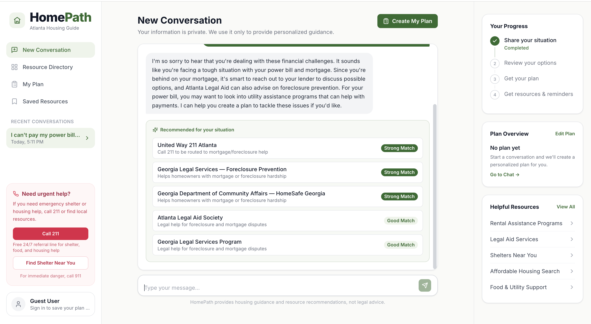
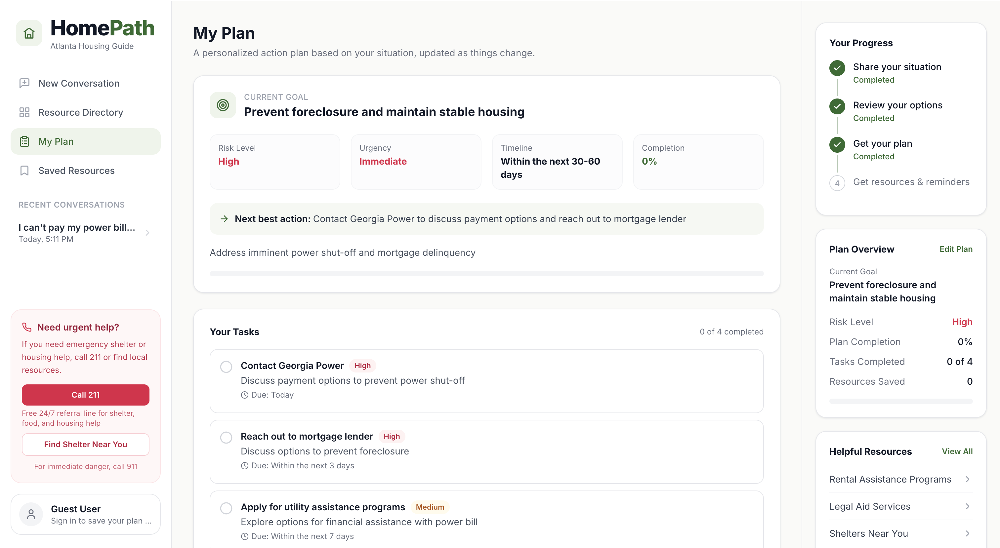
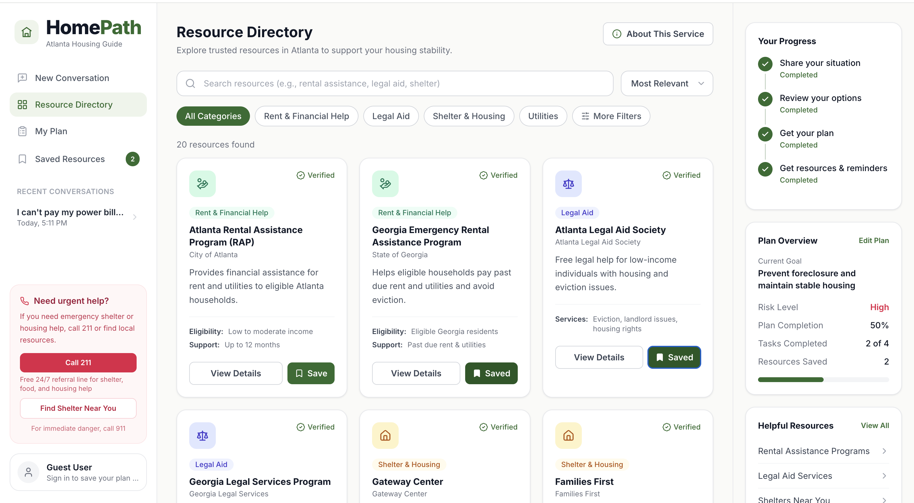
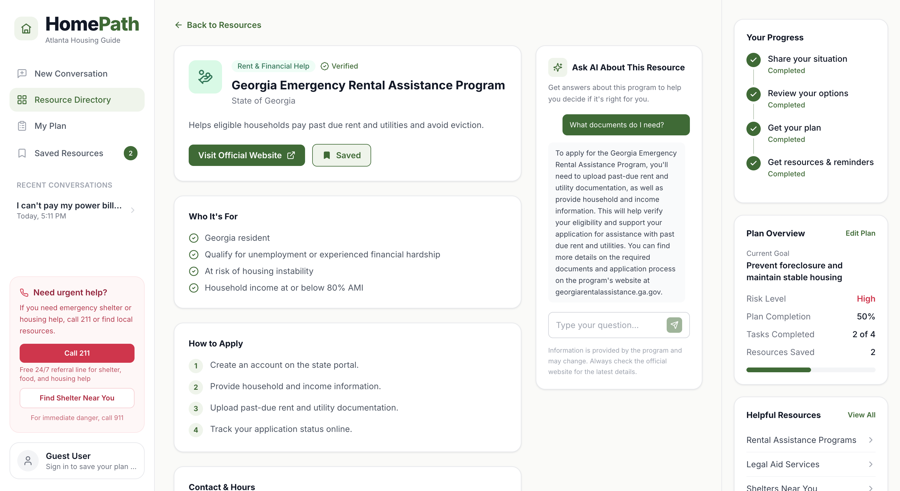

<!--
  ════════════════════════════════════════════════════════════════════
  SUBMISSION CHECKLIST: finish these before submitting on Devpost
  ════════════════════════════════════════════════════════════════════
  [ ] Add Nahom's GitHub handle                     ("Team EDITH" section)
  [ ] Double-check each teammate's role is accurate ("Team EDITH" section)
  [ ] (Optional) Tailor the Problem statement       ("The Problem" section)
  [ ] (Optional) Add a short demo GIF at the top of "Screenshots"

  Already done: hackathon + team info, screenshots, LICENSE, roles.
  ════════════════════════════════════════════════════════════════════
-->

# 🏠 HomePath: Atlanta Housing Guide

> 🏆 **Hackathon:** USAII Global AI Hackathon 2026 (AI Readiness Qualifier) · **Track:** College · **Team:** EDITH
>
> 🎥 **Demo video:** [Watch on YouTube](https://youtu.be/81Nm53fnkA8)

An AI-powered web app that helps Atlanta residents facing a housing crisis (eviction, homelessness, utility shutoff, or financial hardship) get **personalized guidance, matched local resources, and a concrete action plan** in minutes.

A user describes their situation in plain language. An AI housing counselor responds with calm, practical next steps, surfaces the most relevant verified Atlanta resources, and can turn the conversation into a saved, step-by-step plan with trackable tasks.

> **Built to work instantly.** The app runs end-to-end with **zero configuration**: no API keys, no database. Add a free AI key and/or a database to unlock the full experience.

---

## 🎯 The Problem

<!-- OPTIONAL TODO: This statement is ready to use; tailor it if you'd like. -->
_In metro Atlanta, thousands of residents face eviction, utility shutoffs, or homelessness every year, yet the help that exists is scattered across dozens of agencies with confusing eligibility rules. People in crisis don't have time to navigate it. **HomePath** meets them where they are: describe your situation in plain language and instantly get the right local resources plus a clear, personalized action plan._

---

## 📸 Screenshots

| Chat & resource matching | Personalized action plan |
|:---:|:---:|
|  |  |

| Resource directory | Ask AI about a resource |
|:---:|:---:|
|  |  |

---

## ✨ Features

- **AI housing counselor:** a warm, context-aware chat that understands the user's situation and gives the most important next step first.
- **Smart resource matching:** 20 verified Atlanta resources across Rent & Financial Help, Legal Aid, Shelter & Housing, and Utilities, ranked by a dynamic relevance score tailored to the user's situation and urgency.
- **Personalized action plans:** turn a conversation into a step-by-step plan with priorities, due dates, and live completion tracking. Nothing is saved until the user confirms.
- **Ask about any resource:** get plain-language answers about eligibility, documents, and how to apply for a specific program.
- **Save resources & track progress:** bookmark resources and watch a guided progress tracker fill in as you go.
- **Sign in with Google or continue as a guest:** a session is created automatically so your plan and history persist immediately.
- **Crisis-aware & safe:** prominent emergency guidance, careful legal-question handling (general info + referral, never case-specific advice), and no storage of sensitive personal data.

---

## 🧱 Tech Stack

| Layer | Technology |
|---|---|
| **Frontend** | React 18, Vite, Tailwind CSS, React Router, lucide-react |
| **Backend** | Node.js, Express (ES modules) |
| **AI** | [Groq](https://groq.com) (Llama 3.3 70B by default) with a graceful, key-free fallback |
| **Database** | PostgreSQL (optional) with an in-memory fallback |
| **Auth** | Google Sign-In (`google-auth-library`) + guest sessions |

---

## 🚀 Quick Start

You need **Node.js 18+** and **two terminals**: one for the API, one for the web app.

### 1. Backend (API)

```bash
cd server
npm install
cp .env.example .env     # optional, see Configuration below
npm run dev              # API on http://localhost:3001
```

### 2. Frontend (web app)

```bash
# from the project root, in a second terminal
npm install
npm run dev              # app on http://localhost:5173
```

Open **http://localhost:5173** and start a conversation. That's it.

> The frontend proxies `/api` requests to the backend on port 3001, so no extra config is needed in development.

---

## ⚙️ Configuration (all optional)

The app is fully functional with no configuration. Everything below *enhances* it.

Create `server/.env` (copy from `server/.env.example`) and set any of:

| Variable | Purpose | Without it |
|---|---|---|
| `GROQ_API_KEY` | Enables the real AI counselor. Get a free key at [console.groq.com/keys](https://console.groq.com/keys). | Falls back to thoughtful, pre-written responses. |
| `GROQ_MODEL` | Override the AI model (default: `llama-3.3-70b-versatile`). | Uses the default model. |
| `DATABASE_URL` | Enables PostgreSQL persistence. | Runs on in-memory data (resets on restart). |
| `PORT` | API port (default: `3001`). | Uses `3001`. |

**To enable persistence with PostgreSQL:**

```bash
cd server
# set DATABASE_URL in .env, then:
npm run db:init         # creates tables and seeds resource data
npm run dev
```

Check what's active at any time:

```bash
curl http://localhost:3001/api/health
# { "status": "ok", "aiEnabled": true, "dbEnabled": false }
```

---

## 🗺️ How It Works

```
┌─────────────┐   /api/chat    ┌──────────────┐   prompt    ┌──────────┐
│   React UI  │ ─────────────▶ │  Express API │ ──────────▶ │   Groq   │
│  (Vite)     │ ◀───────────── │              │ ◀────────── │  (LLM)   │
└─────────────┘  reply +       └──────┬───────┘   JSON      └──────────┘
                 resources +          │
                 plan signals         ▼
                              ┌────────────────┐
                              │ PostgreSQL  OR  │
                              │ in-memory store │
                              └────────────────┘
```

1. The user chats about their housing situation.
2. The backend asks the AI for a single structured response: a warm conversational **reply** plus a backend-only read of the **situation** and whether a **plan** would help.
3. A relevance engine scores and returns the best-matching Atlanta resources for that situation and urgency.
4. When the user chooses, the conversation is turned into a structured action plan they can review, confirm, and track.

**Graceful degradation** is a core design principle: if the AI key or database is missing or unreachable, the app automatically falls back to deterministic responses and in-memory storage instead of failing.

---

## 📡 API Overview

| Method | Endpoint | Description |
|---|---|---|
| `GET` | `/api/health` | Service status (`aiEnabled`, `dbEnabled`) |
| `POST` | `/api/auth/google` · `/api/auth/guest` · `/api/auth/logout` | Authentication |
| `POST` | `/api/chat` | Conversational turn + matched resources |
| `GET` | `/api/conversations` · `/api/conversations/:id` | Chat history |
| `GET` | `/api/resources` · `/api/resources/:id` | Resource directory |
| `POST` | `/api/resources/:id/save` · `/api/resources/:id/ask` | Save / ask about a resource |
| `POST` | `/api/plans/draft` · `/api/plans/confirm-draft` | Generate & save an action plan |
| `PATCH` | `/api/plans/:planId/tasks/:taskId` | Toggle a task's completion |

---

## 📁 Project Structure

```
HomeStability/
├── src/                     # React frontend
│   ├── components/          # Pages & UI (Chat, Plan, Resources, ...)
│   ├── api/                 # Typed API client wrappers
│   ├── *Context.jsx         # Auth, Saved, Resources state
│   └── data/                # Frontend presentation config
├── server/                  # Express backend
│   ├── routes/              # API endpoints
│   ├── services/            # AI, matching, plans, conversations, auth
│   ├── prompts/             # The housing-counselor system prompt
│   ├── database/            # Schema, seed, and DB connection
│   └── data/                # Canonical Atlanta resource dataset
└── README.md
```

---

## 🔒 Privacy & Safety

- Sensitive personal information is **not stored**.
- The AI gives **general** legal/financial information and always refers users to qualified providers (e.g., Atlanta Legal Aid) for case-specific advice, and never promises outcomes or gives case-specific legal advice.
- Emergency guidance (call 911 / 211) is surfaced prominently throughout the app.

---

## 📜 Available Scripts

**Frontend (project root)**

| Command | Description |
|---|---|
| `npm run dev` | Start the Vite dev server |
| `npm run build` | Production build |
| `npm run preview` | Preview the production build |

**Backend (`server/`)**

| Command | Description |
|---|---|
| `npm run dev` | Start the API with live reload |
| `npm start` | Start the API |
| `npm run db:init` | Create tables and seed data (requires `DATABASE_URL`) |

---

## 👥 Team EDITH

<!-- TODO: Add Nahom's GitHub handle, and adjust any role if needed. -->

- **Samuel Alemu** · _Lead Engineer, Backend & AI_ · [@Samiz244](https://github.com/Samiz244)
- **Mirenge Innocent** · _Frontend Engineer, UI & App State_ · [@minnocent12](https://github.com/minnocent12)
- **Nahom Chemeda** · _Product & Resource Research_ · [@handle](https://github.com/)

---

## 📄 License

Released under the [MIT License](LICENSE).

---

<p align="center"><em>Built for Atlanta residents working to stay housed. 🏡</em></p>
